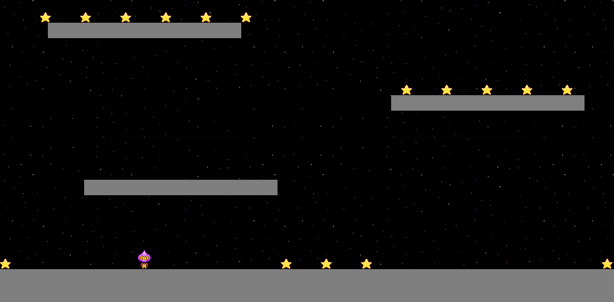
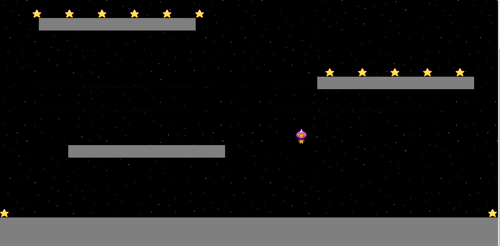

# Jumper Platform Game
A JavaScript adventure game built with Phaser 3

## Table of Contents

* [Game Instructions](#game-instructions)
* [Live Demo](#demo)
* [Built With](#built-with)
* [Testing](#testing)
* [Design Credits](#design-credits)
* [Contributing](#contributing)
* [Acknowledgments](#acknowledgments)
* [Author](#author)
* [License](#license)

## Game Instructions

### Prerequisites

- Using NPM package and JavaScript knoledge to build and test the game.

### Installation

- Fork this repository into your own account
- Run npm install to run all of the dependencies into your local repository
- Run the command 'npm start' to start the game running into your local machine.
- A new tab in your browser should be open to allow you to access the game.

### Game Concept
The main objective of this game is for the avatar to collect as many treats as possible as the avoid being hit by the bombs. In version 2 of this game, I will implement boosters and special skills for tha avatar plus new levels.

### Main Objective

Collect as many treats as possible and try as hard as you can not to get hit by a bomb while you do that.

### How to play

- To move the avatar you should use the 'left' and 'right' arrow keys on your keyboard.
- Jump by pressing the 'up' arrow on your keyboard.

#### Avatar(Player)

- Avatar is the player in this game. They can collect treats and evade bombs.

#### Bomb

- When a bomb comes into collision with the player, it destroys them hence ending the game.

## Demo
[Live Demo](https://pedantic-beaver-d67d0c.netlify.app/)

## Game Development Stages

- **Day 1**
**Learn Phaser 3 module**
 On Day 1, I took a tutorial on Codecademy to learn more about Phaser. After which I went throught the Phaser documentation to get a deeper insight on Phaser. I built a small game to practice what I had learned.

- **Day 2**
**Game Design**
 Pulish the game concept, define the characters and main objective. Look for assets to implement all of the game scenes. Define the game rules and logic. Plan the development of the game in specific chunks of user stories converted to technical tasks to be done. 
  - Game Concept (Done)
  - Characters (Done)
  - Main Objective (Done)
  - Define Game Logic (Done)
  - Implementation Plan (Done)
  - Define Assets (Done)

- **Day 3**
**Scene Development**
  - Created the GitHub repo.
  - Setup CI/CD for the application.
  - Read through the design docs again.
  - Wrote tests.

- **Day 4**
**Game Development**
  - Started building Jumper from my Mockups.
  - Made sure each test passed and deployment worked

- **Day 5**
**Deployment**
  - Run tests (Done)
  - Deploy to netlify (Done)

### Retrospective:

After developing the game and looking back at the initial plan, conceived on the second day these are some reflections about my development.

What went wrong?
Overall, I assume Phaser would be easier. However, it's documentation is confusing (mixed between different versions) and not cohesive enough. This meant a lot of time was invested in googling how to work around specific things, such as animation and tweens. This was not easy at all and very time consuming. The provided examples and tutorial didn't seem enough. 

What went well?
Testing and building Jumper went on smoother that I had initially anticipated. Incorporating Leaderboard API was also pretty quick hence cutting my development time to just a few hours.

## Built With
- Javascript
- HTML
- Phaser 3
- Webpack
- Babel
- Leaderboard API
- JEST testing
- Netlify
- ESlint and Stylelint as linters

## Testing

- Run tests by running: `npm test` on your CLI.

## Contributing

Contributions, issues and feature requests are welcome!

You can do it on [issues page](issues/).

## Acknowledgments

Special thanks to Microverse community:
- Ragdolls team
- Microverse Team

## Show your support

Give a ⭐️ if you like this project!

👤 **Kelyn Paul Njeri**

- Github: [@KelynPNjeri](https://github.com/KelynPNjeri)
- LinkedIn: [KelynNjeri](https://www.linkedin.com/in/kelyn-paul/)

## License

MIT standard license.